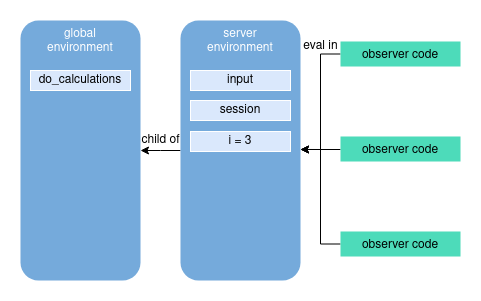

# Preface

I've been recently working a lot in Shiny and I've been constantly stumbling across new problems. Many of them seemed interesting enough for me to want to write an article. However, in the course of the work I found that I had all too much to write about... so I decided that I would break it down into a series of smaller articles linked to each other.

I'll start with something simple: creating some objects in a loop. If you think it's too easy, wait a minute, you may yet be surprised! This seemingly easy task will be an excuse to understand how certain things in R and shiny work underneath, even though we don't pay attention to it every day. 

# Use case and naive solution

Let's start with some simple example. As all simple examples, it may feel extremely artificial, but at least it is not very complex. Let's say that we want to have an app that has four numeric inputs. First input allows user to select an *Important Number*. Other inputs... well, they are not actually used. But we want them to have their values updated every time the *Important Number* is updated. And we want to have separate observers to handle them (yes, I know that one observer would work here as well... but I told you this may feel artificial!). Their values are calculated via some calculations which are completely irrelevant right now.

```r
library(shiny)
# side note: all functions which are not prepended with scope operator 
# are either from base R or from `shiny` package

do_calculations <- function(important, other) {
  # this is totally random
  (important * other * 2^5 + important - 7 * other) %% 101
}

ui <- fluidPage(
  numericInput("important", "Select important number", 
               min = 0, max = 100, value = 42),
  numericInput("var_1", "Select input 1", 
               min = 0, max = 100, value = 0),
  numericInput("var_2", "Select input 2", 
               min = 0, max = 100, value = 0),
  numericInput("var_3", "Select input 3", 
               min = 0, max = 100, value = 0)
)

server <- function(input, output, session) {
  observe({
    updateSliderInput(
      session = session,
      inputId = "var_1",
      value = do_calculations(input[["important"]], 1)
    )
  })

  observe({
    updateSliderInput(
      session = session,
      inputId = "var_2",
      value = do_calculations(input[["important"]], 2)
    )
  })

  observe({
    updateSliderInput(
      session = session,
      inputId = "var_3",
      value = do_calculations(input[["important"]], 3)
    )
  })
}

shinyApp(ui, server)
```


Works like a charm! But we can easily see that there is a lot of copypasting. And copypasting is something we should avoid. (Some other day I would love to say something more about it in general.) If you have gone so far into the article, you probably know what I want to do: a loop. There are two obvious places to use it -- in UI and server. UI first, since it seems easier. We are R users, so we should do *real* loops only when there are no other means. Thus we are using good old `lapply`, as it is even simpler than trying to use *for*.

```r
ui <- fluidPage(
  numericInput("important", "Select important number", 
               min = 0, max = 100, value = 42),
  lapply(1:3, function(i) {
    numericInput(inputId = paste0("var_", i), paste0("Select input ", i), 
                 min = 0, max = 100, value = 0)
  })
)
```

Okay, this is simple, indeed. It works just like without the loop, you can check on your own if you don't believe me. 

Now it's time for server. Here we are calling `observer` mainly for its side effect (i.e. registration of observers) so `for` loop might be more appropriate to use.

```r
server <- function(input, output, session) {
  for (i in 1:3) {
    observe({
      updateSliderInput(
        session = session,
        inputId = paste0("var_", i),
        value = do_calculations(input[["important"]], i)
      )
    })
  }
}
```

And now -- something strange happens! Only the last of the observers works as expected, other seem to be off. If you know at first glance what happens there -- congrats, you are really good at R and Shiny. If you don't know, then we need to understand what environments are relevant for Shiny.

# A quick recap of environments

Each R expression is evaluated in some **environment**. Environment can be think of as a list of names with the values associated with them. There are, however, some differences, of which two are the most important: 

Firstly, each environment contains a **reference to its parent**, so they create a tree-like structure. One exception to this rule is the *empty environment* which does not have a parent and serves as the root of the whole hierarchy. 

Secondly, **environments are mutable**. If you pass an environment to a function and mutate some objects inside of it, the values in the environments are changed also for the external viewer. 

Every time we create an object in R and assign its value to some time, we bind this object within some environment. Calls from console or scripts at the top-level assign objects to *the global environment*. Creating variables inside of a function assigns them to an *execution environment*. Each *package* also has its environment, where all its functions and objects are available. 

When we want to access some variable it is first sought in the *evaluation environment*, i.e. the environment where this call is performed. If no object of this name is found, then it is sought down the **search path**, that is: in the parent environment of the calling env, then in the parent of the parent, etc. down to the empty env. At the start of the R session base packages are inserted into this hierarchy so that those objects are accessible from global environment. Additionally, every time we use `library`, environment of the loaded package is inserted into the path. That explains why we have access to all the functions and object from the console. That also explains why objects in global environment are visible from within the function called in global environment.

One more thing worth mentioning -- in R we can actually manage the time of evaluation of the code. If a function is provided an expression, there are means to suspend evaluation of some of its arguments and either modify it and/or evaluate it later. 

I won't go more into the details how to do it right now (but don't worry, I like the topic too much not to tell more about it). If you want to get new knowledge or refresh the one that you've got, you can see [a chapter in Advanced R by Hadley Wickham](https://adv-r.hadley.nz/environments.html)

# Environments in Shiny

Environments are super crazy useful. The fact that they exist make Shiny work at all. And they are also the reason why our *for* loop did not work. This is, of course, only a part of the whole picture, but such complicated topics are easier to swallow in smaller bits.

We need to focus on what happens, when the app starts (e.g. when function `shinyApp(ui, server)` is called). Somewhere in the guts of Shiny, the `server` function is called. Just as with any other function, it has its own execution environment. This environment is provided with `input` and `output` lists of reactive values, it also has the global environment as its ancestor (and therefore it also has access to any loaded packages). When the code inside this function is executed, objects specified by user are created. Especially, all reactive objects are created and user can modify `input` and `output` reactive values. Also, our objects of focus -- observers -- are registered.

The most important point is: when `server` function is executed and R stumbles upon `observer` call. It **does not** evaluate the code passed as the first argument. Instead it registers the observer and stores the code for later evaluation. We are still at the stage of the start-up and now Shiny only creates net of reactive dependencies. No inputs are even available, they will appear just after somebody opens the browser and initializes the page. This, obviously, also applies to all expressions enclosed in `reactive`'s, `render`'s, etc, but we skip them in the further part as they do not appear in our example.

Now goes the neat part: during the application runtime, code provided to `observer` is evaluated as is in the server function execution environment. So, when it seeks for a variable, it looks for its value in this environment. It does not magically replace `i` variable with value used in the iteration of the loop, as it might be expected. I made a diagram (included below) which illustrates how it **does not** work.


Stating it once again: every time the observer is called, `i` is being sought in the current or enclosing environments. But that rises the question: shouldn't that mean that `i` is missing at all and calling `i` raises an error? Why does it work for one of the observers? The answer is: actually, all three observers work. But they all modify the input number 3. And that is because of one quite peculiar property of R. Namely, variable that is used to iterate **is not destroyed** after finishing the loop execution and it stays in the environment with the value of the last value used in loop. In our case, `i` exists in the server environment and it has value `3`. See diagram below.



As a side note I want to add that there is also topic of visibility of Shiny objects between users' sessions. This is covered by [an article on the official Shiny webpage](https://shiny.rstudio.com/articles/scoping.html). I strongly recommend reading it.

Now, when we know what happens, we need to find out how to make a way around it. There are at lest a few solutions.

# Solution 1: Creation of environment for each observer

I told you that the code in observers etc. is evaluated in the server environment. It is true **by default**. There are ways of changing it, even very simple ways. `observer` function has a parameter `env` which allows us to set the environment of evaluation. 

```r
for (i in 1:3) {
  env <- new.env()
  env[["i"]] <- i
    
  observe({
    updateSliderInput(
      session = session,
      inputId = paste0("var_", i),
      value = do_calculations(input[["important"]], i)
    )
  }, env = env)
}
```

In each iteration of the loop we create a new environment whose parent is the server environment. Then we assign current value of the `i` to the environment and then provide the env as a parameter for observer. As a result, each observer has its own environment with own `i` object. Those envs refer to server env as a parent, so all other variables are accessible from within it. This is possible, because those numerous envs are not used inside of the observers' quoted code, they are kept together with code. This is illustrated on a diagram below.


We can also do the same with a small change. `new.env()` call can be replaced with `rlang::env()`. *rlang* is a package that overhauls the interface of operating on expressions and environments in R, as base R ways of doing it are really messy. A minor change, but on this blog we are going to demonstrate `rlang` features heavily, so you should get used to it. Additional source is [the project webpage](https://rlang.r-lib.org/).

# Solution 2: Injection of constant

Speaking of *rlang*... Second solution employs its features and does something very clever: replaces variable with a constant.

```r
for (i in 1:3) {
  rlang::inject({
    observe({
      updateSliderInput(
        session = session,
        inputId = paste0("var_", !!i),
        value = do_calculations(input[["important"]], !!i)
      )
    })
  })
}
```

Beautiful, isn't it? This code looks almost exactly the same as the code from the not-working approach of simple iteration. First difference is prepending `i` variable appearances with `!!` symbol (*bang-bang*, as ones say, or more professionally: *unquote symbol*). Second is wrapping whole observer with `rlang::inject` function. This function simply replaces everything prepended by unqoutation symbol with the value of the symbol. That operates on the level of expression. Before `observer` is called, both appearances of `i` are replaced with current value of `i`. Only after that the observer is called and modified code is saved instead. You have to admit: this is really elegant. And actually makes the code work as we expected the original code to work, without creation of additional environments.

This is also possible with base R, but code is significantly less appealing and easy to understand, so we will only stick to it.

# Solution 3 (or solution suggestion): Shiny modules

Finally, there is one more solution. If you are already familiar with *shiny modules* then it should be obvious to you that you can use them. I am not gonna provide the code here, though. Those that know modules will find it very easy to create such a solution. Those that are not familiar should definitely learn how to make one. That does not mean that I will not talk about modules at all. I will take care of them in some other part of this series.

# Summary

When environments and modification of expressions come into play, even as simple things as loops may get complicated. I wanted to show you that coming across them in R (especially in Shiny) is really easy and without slightly deeper understanding of it, they might seem illogical and not rarely impossible to overcome. Having the additional knowledge and ability to use such tools as `rlang` might allow you to make your code better and cleaner. And sometimes working at all.
