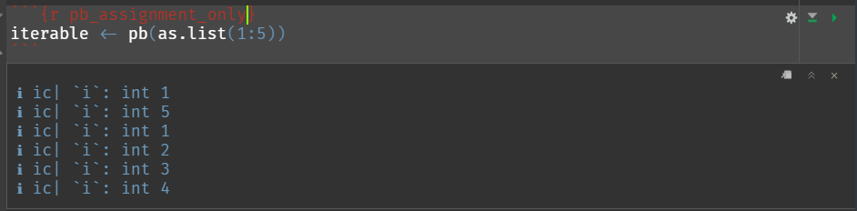
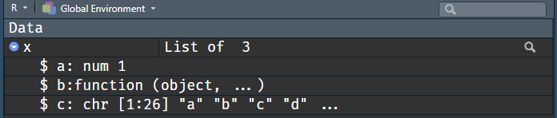
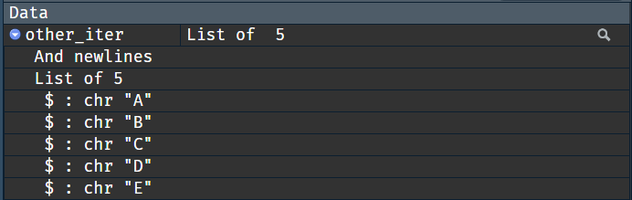

A short disclaimer first: this post isn't meant to criticise RStudio. It's my favourite IDE, and I've grown so accustomed to it that I'd have trouble trying to write R code in any other piece of software. This post is to show an unexpected interaction with one of RStudio systems that an ambitious R programmer could make use of.

You'll find a question meant as an exercise in this post; the answer is right at the bottom.

Let's get to the story setting now.

## The setting

I've been doing some Python coding and I needed a progress bar to keep track of processed cases. The internet recommended [tqdm](https://tqdm.github.io), an extremely simple-to-use package -- just wrap the iterable in `tqdm()` and the progress bar will spawn upon iterating. Immediately, I started thinking about an analogous R solution.

There are multiple options for including a progress bar in R -- the base `txtProgressBar()` function, the [progress](https://github.com/r-lib/progress) and [progressr](https://github.com/HenrikBengtsson/progressr) packages, the [`cli::cli_progress_bar()`](https://cli.r-lib.org/articles/progress.html) function too... None as simple as tqdm, though.

(At least that's what I was thinking at the time.)

Naturally, I had to try my hand at implementing it. You can check the [turtletopia/aurrera](https://github.com/turtletopia/aurrera) repository for the current state of the code[^1], but the key chunks are shown in this post anyways.

Marking the iterable as spawning a progress bar should be as noninvasive as possible, so that all operations on the underlying object proceed as before. Injecting an attribute with a progress bar reference is not a bad idea, but it _slightly_ increases the chance of name clash with an attribute given elsewhere. Let's stick with a simple class:

```{r aurrera_class}
pb <- function(object) {
  class(object) <- c("aurrera_iter", class(object))
  object
}
```

Oh, and add progress bar initialization in there too. We won't be getting into the details of the implementation right now, we'll only note that only the object's length is needed.

```{r aurrera_class_bar_init}
pb <- function(object) {
  initialize_bar(length(object))
  class(object) <- c("aurrera_iter", class(object))
  object
}
```

(`initialize_bar()` is a function that assigns a fresh bar to a global variable inside the package. Question for today: why is it a very fragile idea?)

Most iterators use accessors (i.e. `[` and `[[` operators, predominately the latter) to extract elements for successive loops. It's not true for `for` loops, but `lapply()`, `purrr::map()`, `Reduce()`, and others -- they all use `[[` at some point. Thus, some signal should be emitted upon calling the extractor.

```{r aurrera_extract}
`[[.aurrera_iter` <- function(x, i) {
  advance_bar()
  NextMethod()
}
```

I'll implement the `initialize_bar()` and `advance_bar()` functions behind the scenes and it'll be up and running just fine. Right?

```{r behind_the_scenes, include=FALSE}
.PROGRESS_BAR <- NULL

initialize_bar <- function(len, ...) {
  .PROGRESS_BAR <<- structure(
    txtProgressBar(min = 0, max = len, ..., width = 60),
    pb_length = len
  )
}

advance_bar <- function() {
  progress <- getTxtProgressBar(.PROGRESS_BAR)
  setTxtProgressBar(.PROGRESS_BAR, progress + 1)
  if (progress + 1 == attr(.PROGRESS_BAR, "pb_length", exact = TRUE)) {
    close(.PROGRESS_BAR)
    .PROGRESS_BAR <<- NULL
  }
}
```

## The mystery

The `pb()` function is supposed to wrap the iterable object inside an iterator; this provides a simple way to enrich the existing code with progress bars:

```{r pb_in_func}
iterable <- as.list(1:5)
sapply(pb(iterable), identity)
```

The argument order makes `pb()` pipeable too:

```{r pb_in_pipe}
as.list(1:5) |>
  pb() |>
  purrr::reduce(sum)
```

If we want, we can assign an `aurrera_iter` object to a variable and use it in an iterator as well:

```{r pb_in_assignment}
iterable <- pb(as.list(1:5))
purrr::map_int(iterable, identity)
```

So far so good.

But... have you tried running this code by yourself in RStudio? I did, using the "Run Chunk" option in the .Rmd file containing this very post.

The first two examples work just as depicted. The last one, though...


The `.PROGRESS_BAR` is set to `NULL` upon terminating (i.e. reaching completion), which `getTxtProgressBar()` doesn't like too much. This is understandable, but... why would the bar terminate in the first place?

## The investigation

I investigated the issue by making the code a bit more verbose. The bar is closed when advanced for the n-th time, so there's must be something that triggers this advancing. Perhaps [an ice cream](/2022/07/28/ice-cream-for-r-programmers/) strategically placed in the `[[` method could shed some light?

```{r aurrera_extract_with_ic}
`[[.aurrera_iter` <- function(x, i) {
  icecream::ic(i)
  advance_bar()
  NextMethod()
}
```

Now let me run the faulty code line by--

```{r pb_assignment_only}
iterable <- pb(as.list(1:5))
```



Oh.

There's a tool that helps track down the source call: `sys.calls()`. I replaced the `icecream::ic()` call with a `browser()` and ran the line above. It failed and my R died.

Then I removed the `browser()` call and inserted a `print(sys.calls())`. Which did not print anything to the console.

I switched back to `icecream::ic()` and managed to display the length of `sys.calls()`, amounting to 26.

Finally, I added a `for` loop that printed successive calls from `sys.calls()` using `icecream::ic()`. The top entry was the offender and the solution laid further down the tree.

## The solution

The `[[` calls were triggered by a function named `.rs.describeObject()`. This -- like all other objects with names starting with `.rs.` -- is used by RStudio to provide all sorts of functionalities. They are all stored in a `tools:rstudio` environment that's by default a child of `package:stats` and a parent of the global environment, albeit the latter stops being true upon attaching other packages (they are attached between `tools:rstudio` and the global env).

What is this function for? Turns out that `.rs.describeObject()` is used to create a description displayed in "Environment" tab! The in-depth investigation explains why there was no `print()` output -- this function uses `capture.output()` to collect the string to display.

And the function that provides this output -- and makes calls to `[[` -- is `str()`. `utils:::str.default()`, to be precise. It's a nearly 600 lines long behemoth that performs a lot of implicit dispatch, so it's more of a `str.list()` in this case. And it iterates over the list to provide a simplified glimpse into the list's structure, which can be seen in "Environment" tab as well:



The solution was simple; I implemented a custom `str.aurrera_iter()` method that delegated to the other methods -- but only after temporarily removing `aurrera_iter` class from the object, so that the following calls wouldn't dispatch to `[[.aurrera_iter`:

```{r str_aurrera_iter}
str.aurrera_iter <- function(object, ...) {
  cat("Bar-spawning ")
  class(object) <- setdiff(class(object), "aurrera_iter")
  NextMethod()
}
```

As a side note, I have added a short text to display before the actual contents of `str()`, but refrained from inserting a newline. It was a deliberate action, because the `.rs.describeObject()` function (actually `.rs.valueContentsImpl()` called for lists, data frames, and S4 objects) is hardcoded to treat all lines but the first one as object's contents. Should I add a newline character or two...

```{r str_aurrera_iter_newlines, eval=FALSE}
str.aurrera_iter <- function(object, ...) {
  cat("Spawns progress bars\nAnd newlines\n")
  class(object) <- setdiff(class(object), "aurrera_iter")
  NextMethod()
}
```

...I'd be getting this curiosity:



Now I want the option to customize RStudio variable descriptions!

_opens the RStudio repository on Github_

## The future

Having fixed the problem, I was able to proceed with the idea. I've implemented a basic solution covering the simplest case of one iterable processed by an iterator function like `lapply()`, `purrr::map()`, or `foreach::foreach()`, and I was planning on wrapping the loose ends and preparing the package for wider audience.

However, I've come across an experimental function in cli package, [`cli::cli_progress_along()`](https://cli.r-lib.org/reference/cli_progress_along.html). It takes advantage of the same idea, linking a progress bar to an iterable and responding to an iterator action. So, I've moved on to other ideas, thinking the niche is already being covered.

I think I might have been wrong there. I've read more about `cli::cli_progress_along()` while researching for this post and I've noticed a peculiar feature -- the function performs a `seq_along()` action, meaning that the iterator isn't provided with iterable's elements; it receives indices instead!

This is huge, for me at least. Being clear about objects being passed to iterators is paramount to loop readability; code in the form of

```{r bad_loop, eval=FALSE}
x <- c("a character", "vector", "to process")

lapply(seq_along(x), function(index) {
  do_process(x[[index]])
})
```

is much less intuitive than

```{r fine_loop, eval=FALSE}
lapply(x, function(element) {
  do_process(element)
})
```

and the latter sometimes enables an even shorter, more concise form of

```{r finer_loop, eval=FALSE}
lapply(x, do_process)
```

Perhaps [aurrera](https://github.com/turtletopia/aurrera) may not be so dead after all. It still fails to produce a progress bar when used with `for` or `rapply()`; it doesn't integrate with any solution other than base R; it fails without grace when anything goes not to plan. But, there's no package, no function (that I know of) that I could take, wrap over a variable in an existing piece of code, and have it simply work. No adjustments needed.

## Today's question's answer

A simple, very likely scenario that breaks the code:

```{r answer_1, eval=FALSE}
iter_1 <- pb(letters)
iter_2 <- pb(1:10)
lapply(iter_1, nchar)
```

The second call to `pb()` overwrites the bar created in the first one, yet the loop triggers the progress based on the first iterable. We can avoid this scenario by initializing the bar lazily, when the first iteration is triggered; or by initializing separate bars for each `pb()` call.

[^1]: Citing the original: "*tqdm* means 'progress' in Arabic (*taqadum*, تقدّم)". It made sense to name the package in a similar vein. In Basque, "progress" is translated as *aurrerapen* or *aurrerabide*, but it wasn't too catchy of a name, so I settled on *aurrera*, meaning "forward".
