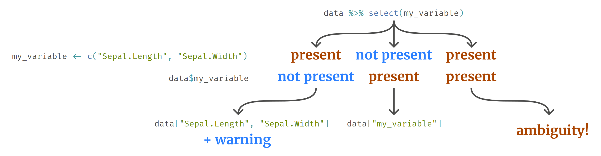
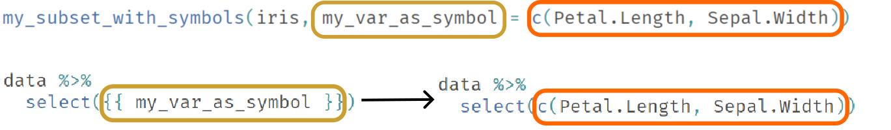

## Intro

Hello everyone! After an extended hiatus for various reasons (from graduating college to navigating job changes and legal challenges), we're back and eager to breathe new life into this blog. Given my deep interest in the fundamentals of advanced methods, today we're delving into an essential topic every dplyr user will eventually face.

dplyr is meticulously designed with the primary goal of making code workflows read possibly close to natural languages. This design philosophy manifests in two critical dimensions: *semantic* and *syntactic*.

Semantically, the emphasis is on **employing words with intuitive and easily understood meanings**. For instance, dplyr and its friends adhere to a robust naming convention where function names typically take on verb forms, elucidating the action they perform.

Syntactically, the **arrangement and combination of these descriptive words is paramount**. Arguably, this is even more critical to the user experience. One of the most evident manifestations of this syntactical approach is the tidyverse's hallmark feature: **the pipe operator**. But we are not going to tackle this today. I will look into caveats of another essential and intuitive syntactic feature: the **use of symbols instead of strings to refer to variables within datasets**. This offers a more natural-feeling mode of interaction but, as I have found out over many years of using R, this feature can lead to some problems.


```{r message=FALSE, warning=FALSE, include=FALSE}
library(dplyr)
iris <- iris %>% slice(1:5)
```

## Problem 1: Symbols vs. strings with names

Let's compare how we select columns in a data frame using base R versus dplyr:

```{r eval=FALSE}
# base
iris[, c("Sepal.Length", "Sepal.Width")]

# dplyr
iris %>%
  select(Sepal.Length, Sepal.Width)
```

Notice the difference:

* In base R, we use `"Sepal.Length", "Sepal.Width"`, which are **strings** enclosed in quotes (single and double quotes are both valid).
* With dplyr, we have `Sepal.Length, Sepal.Width`, unquoted **symbols**.

In the second case *symbols* are used to access columns in a data frame, just like we use symbols to access any variable or function that we store in our top-level environments.
It is vital to grasp this distinction to sidestep potential pitfalls. which I will discuss in the rest of the post.

So, what symbols actually are? We use them as names of objects and this is the identity of their core. This is why it feels natural to use them to not only access top-level variables, but also variables in data. There is more to the nature of symbols, but we will come back to that later.

Notice that dplyr is smart enough to let you select variables by strings as well:

```{r}
iris %>%
  select("Sepal.Length", "Sepal.Width")
```

This is, however, inadvisable, as this is exactly what tidyverse designers wanted to avoid.

Now, consider a scenario where we have an external variable storing column names:

```{r}
my_variables <- c("Sepal.Length", "Sepal.Width")
```

Although it might seem intuitive to directly supply it to select:

```{r warning=TRUE}
iris %>%
  select(my_variables)
```

This generates a warning. Given the tidyverse's informative error messages, it's wise to pay heed. Directly supplying can be ambiguous -- imagine having a column named `my_variable`. Which should be selected if we have both the column and the external variable?



To ensure clarity, dplyr authors suggest using dplyr::all_of(), which explicitly converts a name vector into symbols, resolving any ambiguities.

```{r warning=TRUE}
iris %>%
  select(all_of(my_variables))
```

## Problem 2: Passing column names as arguments to custom functions

Differentiating between passing a variable name or a symbol becomes trickier when constructing functions that internally use dplyr verbs. Consider:

```{r}
my_subset <- function(data, my_var) {
  data %>%
    select(my_var)
}
```

This might cause a lot of issues. Should we provide a string as a name (`my_subset(iris, "Sepal.Length")`) or a symbol (`my_subset(iris, Sepal.Length)`)?  To answer this question, **we should first be clear about our intent** (it would be nice to write a few words of documentation -- for other users or for ourselves in the future). **Both approaches are possible and valid**. It is important to **choose one and remain consistent** across all functions that we write.

For instances where column names are passed as strings (common in Shiny apps when columns are selected by some input), one could utilize the previously discussed `dplyr::all_of()`:


```{r, eval=FALSE}
my_subset_with_strings <- function(data, my_var_as_string) {
  data %>%
    select(all_of(my_var_as_string))
}

my_subset_with_strings(iris, c("Sepal.Length", "Sepal.Width"))
```

If we want to use symbols, just like directly in dplyr functions (mostly when those columns to use are predefined, be it in our internal functions or in analyses), we have to *embrace* the variable:

```{r, eval=FALSE}
my_subset_with_symbols <- function(data, my_var_as_symbol) {
  data %>%
    select({{ my_var_as_symbol }})
}

my_subset_with_symbols(iris, Petal.Length)

# We still need to wrap column names in a vector if we provide more than one of them for a single parameter
# (or we can use ellipsis operator for the function, but this is a separate design question)
my_subset_with_symbols(iris, c(Petal.Length, Sepal.Width))
```

In this way we let dplyr know that `my_var_as_symbol` has to be passed directly as user provided it. We can think of embracing as of cut-paste operation. We tell dplyr: "Take what user provided in place of `my_var_as_symbol` in function call and plug it directly into `select`, without creating any intermediate variables.". Call to `my_subset_with_symbols()` is basically replaced with what lies inside of it. 



## Problem 3: Dynamic columns in purrr formulas in `across` 

While the above solutions work seamlessly with functions like `dplyr::select()`, challenges arise when operations grow complex. Suppose we wish to craft a function, `do_magic`, that takes `data`, a special `column`, and several `other` columns. This function should add the special `column` to all `other`. For now, do not assume in what form `column` and `other` parameters are provided.

The naive way of doing it, would be to construct some `dplyr::mutate()` call that would operate on each of the provided columns:


```{r eval=FALSE}
# only for illustration purposes, won't actually work:
data %>%
  mutate(
    other[[1]] = other[[1]] + special,
    other[[2]] = other[[2]] + special,
    ...
    other[[N]] = other[[N]] + special
  )
```


As you might have known, the code above will not be functional, neither inside or outside function -- you cannot index neither character vector nor symbol on the left side of argument assignment in `dplyr::mutate()` call. We need to use another tool: `dplyr::across()`. Its syntax is:

```{r eval=FALSE}
data %>% mutate(across(columns_to_mutate, function_to_apply))
```

For custom, unnamed functions, the *function shorthand syntax* `\(x)` is beneficial. The idea from example above could be rewritten as:

```{r eval=FALSE}
# still won't work, but we are getting somewhere:
data %>%
  mutate(
    across(other, \(x) + special)
  )
```

Now it is time to actually encapsulate this into a function and think about how to pass those column names as parameters. Since we are already armed with knowledge of previous chapter of this article we might try embracing first:

```{r}
do_magic <- function(data, special, other) {
  data %>%
    mutate(across({{other}}, \(x) + {{special}}))
} 

do_magic(iris, Petal.Length, c(Sepal.Length, Petal.Width))
```

Hooray! It works just fine! However, at this point it is worth trying it out another way and asking question: what if we want to pass those parameters as strings? Again, we can go back to the example from before and use supporting functions to transform the strings into actual selections:

```{r}
do_magic <- function(data, special, other) {
  data %>%
    mutate(across(all_of(other), \(x) - all_of(special)))
}

# won't work:
# do_magic(iris, special = "Petal.Length", other = c("Sepal.Length", "Sepal.Width"))
```

Surprisingly, it fails! The reason for that is simple: the function we pass into across (in this case: `\(x) - all_of(special)`) is unable to evaluate this selector function as it is unexpected there. Tidyselect rules (the ones that make `all_of()` and its friends possible) are not automagical and require to be invoked manually by the function designer. `dplyr::select` knows that it might expect such expressions but inside some seemingly random function it cannot evaluate properly on its own. 

So, what to do now? We can try mixed approach with embracing:

```{r}
do_magic_but_better <- function(data, special, other) {
  data %>%
    mutate(across(all_of(other), ~ .x - {{special}}))
}

do_magic_but_better(iris, special = Petal.Length, other = c("Sepal.Length", "Sepal.Width"))
```

This works. How come then that embracing inside anonymous function works while `all_of` helper does not? This is because they use a very different approach and detailed explanation goes out of the scope of this article. To simplify: embracing is a more general approach for replacing one chunk of a code with another provided as a parameter.

The one issue with above approach is that it does not look fine: one parameter is provided as symbol, another one is as character vector... **We should always aim at being consistent**. Either all column-like parameters should be symbols or all should be character strings. There are pros and cons to both ways. Let's say that we want to stick to strings only. How can we do it?

#### Tip: when `all_of()` does not work, use `.data`

There's a workaround for this conundrum:

```{r}
do_magic_but_in_other_way <- function(data, special, other) {
  data %>%
    mutate(across(all_of(other), ~ .x - .data[[special]]))
}

do_magic_but_in_other_way(iris, special = "Petal.Length", other = c("Sepal.Length", "Sepal.Width"))
```

When you need to reference the underlying data within the context of dplyr functions, the `.data` pronoun comes to the rescue. It is available also from within the function that is evaluated inside `across` helper. As demonstrated, it operates similarly to directly accessing the data and as a result, we can use regular base extraction operator.

## Summary & Next Steps

Throughout this post, we ventured deep into some of the intricacies of dplyr. We've unraveled how the package strives to make our code both semantic and syntactic, all while simplifying complex operations. The power of symbols and the utility of functions and pronouns like `all_of()` and `.data` demonstrate just how dynamic and adaptable dplyr can be, especially when working with variable column names. While we've covered much ground, the world of dplyr is vast and constantly evolving. We are aware that all this *embracing* and *tidyselect* rules might be intimidating, but we will continue to explore more facets of the tidyverse in future posts of "basic advanceds", aiming to empower you with advanced techniques that enhance your data analysis journey.

If you've found this post enlightening and wish to delve deeper, or if you have any questions or insights, we'd love to hear from you! You can contact us directly via [X](https://twitter.com/Rturtletopia). Alternatively, for those who prefer a more open-source avenue, feel free to open an issue on our [GitHub](https://github.com/turtletopia/turtletopia.github.io/issues) repository. Your feedback and insights not only help us improve, but they also contribute to the broader data science community.

Until next time, keep exploring, learning, and sharing!

## Dive Deeper: Resources for the Curious Minds:

For those wishing to delve further or who may have lingering questions a great resource would be [dplyr official programming guide](https://dplyr.tidyverse.org/articles/programming.html). If this is still not enough for you, we recommend a few chapters of [Advanced R book](https://adv-r.hadley.nz/metaprogramming.html) that focus on metaprogramming and underlying tools used to build tidyverse. 
